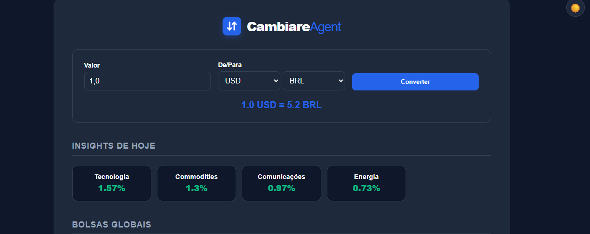

# 💹 Cambiare Agent -- Inteligência de Câmbio & Mercado

O **Cambiare Agent** é um Dashboard Financeiro moderno que combina
conversão de moedas em tempo real com insights estratégicos de mercado
global. Desenvolvido para oferecer uma experiência de usuário (UX)
fluida, o agente monitora a performance de ETFs e índices mundiais para
auxiliar na visualização de tendências econômicas.

------------------------------------------------------------------------

## 🚀 Funcionalidades

-   **Conversão de Câmbio Real-Time:** Integração com APIs financeiras para as principais moedas globais (BRL, USD, EUR, JPY, CAD).
-   **Market Insights:** Monitoramento de performance diária de ETFs setoriais e índices das principais bolsas mundiais (S&P 500, Nasdaq, Ibovespa, etc.).
-   **UI/UX Moderna:** Interface responsiva com Glassmorphism, tipografia refinada e cards de dados homogêneos.
-   **Smart Dark Mode:** Sistema de troca de tema (Light/Dark) com persistência via `localStorage`.
-   **Arquitetura Escalável:** Separação clara entre serviços de dados, lógica de backend (Flask) e interface.

------------------------------------------------------------------------

## 🛠️ Tecnologias Utilizadas

-   **Backend:** Python 3.9+ com [Flask](https://flask.palletsprojects.com/)
-   **Frontend:** HTML5, CSS3 (Variáveis Modernas, Flexbox/Grid) e JavaScript Vanilla
-   **APIs de Dados:** Finnhub API e ER API (Dados de mercado e ETFs)
-   **Integração:** Requests (Consumo de APIs REST)

------------------------------------------------------------------------

## 📦 Como Instalar e Rodar

1.  **Clone o repositório:**

    ``` bash
    git clone https://github.com/m-m-legend/cambiare.git
    cd cambiare
    ```

2.  **Configure o ambiente virtual:**

    ``` bash
    python -m venv venv
    source venv/bin/activate  # No Windows: venv\Scripts\activate
    ```

3.  **Instale as dependências:**

    ``` bash
    pip install -r requirements.txt
    ```

4.  **Configure suas chaves:** crie um arquivo .env na raiz do projeto e
    adicione sua chave da API

    ``` bash
    FINNHUB_API_KEY=sua_chave_aqui
    ```

5.  **Execute a aplicação:**

    ``` bash
    python app.py
    ```

------------------------------------------------------------------------

## ⚖️ Disclaimer

Este projeto tem finalidade estritamente educacional. Os dados de
mercado podem apresentar atrasos conforme as limitações das APIs
gratuitas. Não constitui recomendação de investimento ou aconselhamento
financeiro profissional.

## 📸 Preview da interface


