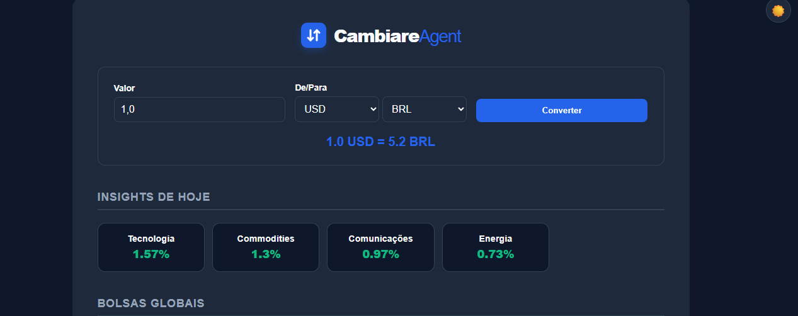

# 💹 Cambiare Agent -- Currency Intelligence & Market
The **Cambiare Agent** is a modern Financial Dashboard that combines
real-time currency conversion with strategic insights from the global
market. Developed to offer a fluid user experience (UX), the agent
monitors the performance of ETFs and world indices to assist in
visualizing economic trends.
------------------------------------------------------------------------
## 🚀 Features
-   **Real-Time Currency Conversion:** Integration with financial APIs for major global currencies (BRL, USD, EUR, JPY, CAD).
-   **Market Insights:** Daily performance monitoring of sectoral ETFs and indices from major world exchanges (S&P 500, Nasdaq, Ibovespa, etc.).
-   **Modern UI/UX:** Responsive interface with Glassmorphism, refined typography and homogeneous data cards.
-   **Smart Dark Mode:** Theme switching system (Light/Dark) with persistence via `localStorage`.
-   **Scalable Architecture:** Clear separation between data services, backend logic (Flask) and interface.
------------------------------------------------------------------------
## 🛠️ Technologies Used
-   **Backend:** Python 3.9+ with [Flask](https://flask.palletsprojects.com/)
-   **Frontend:** HTML5, CSS3 (Modern Variables, Flexbox/Grid) and Vanilla JavaScript
-   **Data APIs:** Finnhub API and ER API (Market data and ETFs)
-   **Integration:** Requests (REST API Consumption)
------------------------------------------------------------------------
## 📦 How to Install and Run
1.  **Clone the repository:**
    ``` bash
    git clone https://github.com/m-m-legend/cambiare.git
    cd cambiare
    ```
2.  **Configure the virtual environment:**
    ``` bash
    python -m venv venv
    source venv/bin/activate  # On Windows: venv\Scripts\activate
    ```
3.  **Install dependencies:**
    ``` bash
    pip install -r requirements.txt
    ```
4.  **Configure your keys:** create a .env file at the root of the project and
    add your API key
    ``` bash
    FINNHUB_API_KEY=your_key_here
    ```
5.  **Run the application:**
    ``` bash
    python app.py
    ```
------------------------------------------------------------------------
## ⚖️ Disclaimer
This project is strictly for educational purposes. Market data may be
delayed according to the limitations of free APIs. It does not constitute
investment recommendation or professional financial advice.
## 📸 Interface Preview

